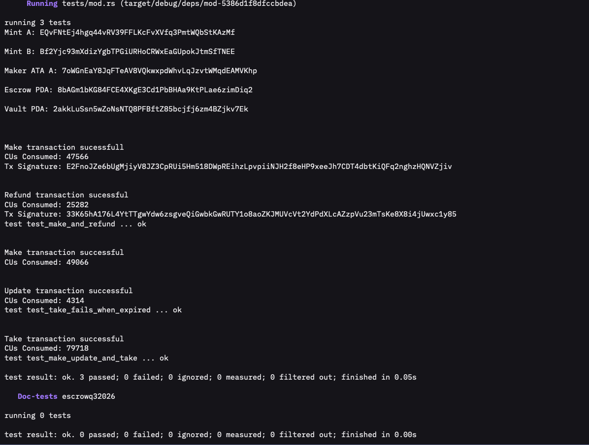

# Escrow (Q3 2026)

An Anchor program on Solana that lets two parties swap SPL tokens atomically, with no third party and no trust required.

- **Maker** deposits token A into a program-owned vault and states how much of token B they want back, plus an expiration time.
- **Taker** — anyone holding enough token B — can accept the offer before it expires: they send token B to the maker and receive the vaulted token A in return, all in a single atomic transaction.
- If nobody takes the offer, the **maker can refund** themselves at any time (even after expiration).
- The maker can also **update** the expiration on an offer that hasn't expired yet, extending it into the future.

Program ID: `Gp1uxyixK9wdj4bBGhN6Xar6iFWYs9dEShGjjwz4D4Ck`

## Instructions

| Instruction | Signer | What happens |
|---|---|---|
| `make` | maker | Creates the `Escrow` state account and deposits `deposit` amount of mint A into the vault. |
| `take` | taker | Fails if `now > expiration`. Otherwise: transfers `receive` amount of mint B from taker to maker, transfers the vault's mint A to the taker, then closes the vault (rent → maker) and the escrow account (rent → maker). |
| `refund` | maker | Returns the vault's full mint A balance to the maker and closes the vault + escrow account. Works even after expiration — this is the maker's safety net. |
| `update` | maker | Changes `expiration` on an escrow that hasn't expired yet, as long as the new value is also in the future. |

## Architecture

```
Maker deposits token A  →  vault (PDA-owned)
                                      ↓  taker sends token B to maker
                                      ↓  vault releases token A to taker
                                      ↓  escrow + vault accounts closed, rent returned
```

- `escrow` is a PDA derived from `["escrow", maker, seed]` — one escrow per maker+seed.
- `vault` is an associated token account for mint A, owned by the `escrow` PDA — not a separate PDA of its own.
- Moving tokens *out* of the vault (in `take` and `refund`) requires the escrow PDA to sign the transfer via `CpiContext::new_with_signer`, using `["escrow", maker, seed, bump]` as the signer seeds.

See `arch/make.png`, `arch/take.png`, and `arch/refund.png` for per-instruction account-flow diagrams.

## Program layout

```
programs/escrowq32026/src/
├── lib.rs                    # #[program] entrypoints (discriminators 0-3)
├── state.rs                  # Escrow account: seed, maker, mint_a, mint_b, receive, bump, expiration
├── constants.rs               # ESCROW_SEED
├── error.rs                  # EscrowExpired, InvalidExpiration
└── instructions/
    ├── make.rs               # init_escrow + deposit
    ├── take.rs               # expiration check + token swap + vault close
    ├── refund.rs             # withdraw vault to maker + close
    └── update.rs             # extend expiration
```

## Testing

Tests run against [LiteSVM](https://github.com/LiteSVM/litesvm) (an in-process Solana VM — no local validator needed) in `programs/escrowq32026/tests/mod.rs`:

- `test_make_and_refund` — maker creates an escrow, then reclaims their deposit via `refund`.
- `test_make_update_and_take` — maker creates an escrow, extends its expiration via `update`, then a taker completes the swap via `take`; balances and account closures are asserted at every step.
- `test_take_fails_when_expired` — an escrow made with a negative `expiration` is already expired; `take` is asserted to fail, and the transaction's atomicity is verified by checking that no balances moved.

```bash
cargo test -p escrowq32026
```

Screenshot of a full passing test run (all 3 tests green):



## Requirements

- Rust toolchain pinned in `rust-toolchain.toml`
- `anchor-lang` / `anchor-spl` 1.1.2 (see `programs/escrowq32026/Cargo.toml`)
