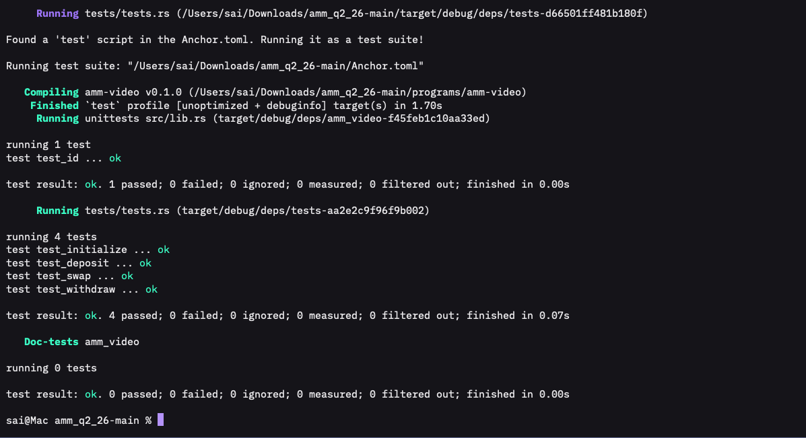

# Constant-Product AMM on Solana

This repository contains a Solana automated market maker (AMM) written in Rust with the Anchor framework. It supports pool initialization, liquidity deposits, liquidity withdrawals, token swaps, configurable swap fees, and treasury fee collection.


## Features

### Initialize a pool

The `initialize` instruction:

- Creates the pool configuration PDA.
- Creates the LP-token mint controlled by the pool PDA.
- Creates token X and token Y vaults controlled by the pool PDA.
- Stores the fee in basis points.
- Stores the treasury wallet address.
- Creates treasury-associated token accounts for token X and token Y.
- Rejects identical pool mints, invalid treasury addresses, and fees of 100% or more.

### Deposit liquidity

The `deposit` instruction:

- Transfers token X and token Y from the liquidity provider to the pool vaults.
- Calculates proportional deposits after the pool has initial liquidity.
- Mints LP tokens to represent the provider's pool ownership.
- Applies maximum-input slippage protection.

### Withdraw liquidity

The `withdraw` instruction:

- Burns the user's LP tokens.
- Calculates the user's proportional share of both pool tokens.
- Transfers token X and token Y from the vaults to the user.
- Applies minimum-output slippage protection.

### Swap tokens and collect fees

The `swap` instruction supports both token directions:

- Token X to token Y
- Token Y to token X

The fee is expressed in basis points:

```text
1 basis point   = 0.01%
30 basis points = 0.30%
100 basis points = 1%
```

For every swap, the program calculates:

```text
fee_amount  = input_amount × fee_basis_points / 10,000
pool_amount = input_amount - fee_amount
```

For example, a swap of `10,000,000` token units with a 30-basis-point fee produces:

```text
Input amount:     10,000,000
Treasury fee:         30,000
Pool input:        9,970,000
```

The net input enters the AMM vault, while the fee is transferred to the treasury token account for the input mint. The output is calculated from the net input using the constant-product curve.

## Account structure

```text
Pool config PDA
├── Token X vault
├── Token Y vault
└── LP-token mint authority

Treasury wallet
├── Treasury token X associated token account
└── Treasury token Y associated token account
```

The swap instruction verifies that the supplied treasury wallet matches the address stored in the pool configuration. Anchor also validates the mint and authority of both treasury token accounts, preventing fees from being redirected to an arbitrary account.

## Program instructions

| Instruction | Purpose |
| --- | --- |
| `initialize` | Creates the pool, LP mint, vaults, and treasury token accounts |
| `deposit` | Adds token X and token Y liquidity and mints LP tokens |
| `withdraw` | Burns LP tokens and returns the provider's share of the pool |
| `swap` | Exchanges one pool token for the other and sends the fee to treasury |

## Project structure

```text
programs/amm-video/
├── src/
│   ├── lib.rs
│   ├── state.rs
│   ├── error.rs
│   └── instructions/
│       ├── initialize.rs
│       ├── deposit.rs
│       ├── withdraw.rs
│       └── swap.rs
└── tests/
    ├── tests.rs
    └── ix_handlers/
        ├── init.rs
        ├── deposit.rs
        ├── withdraw.rs
        └── swap.rs
```

## Requirements

- Rust toolchain `1.89.0`
- Solana CLI with `cargo-build-sbf`
- Anchor CLI

The program currently uses `anchor-lang` and `anchor-spl` version `1.0.1`.

## Build and test

Run the following commands from the repository root:

```bash
anchor build
cargo test --workspace
```

The build must run before the tests because LiteSVM loads the compiled program from:

```text
target/deploy/amm_video.so
```

To verify formatting as well:

```bash
cargo fmt --all -- --check
```

## Tests

The LiteSVM suite currently covers successful execution of:

- Pool initialization
- Liquidity deposit
- Liquidity withdrawal
- Token X to token Y swap
- Treasury fee transfer

The swap test verifies that a `10,000,000` input with a 30-basis-point fee transfers exactly `30,000` token units to the treasury.

### Test proof



The captured test run shows:

```text
Program ID test: 1 passed
AMM instruction tests: 4 passed
Failed tests: 0
```


## Local program address

```text
7sMZ4Mcfu31WW9fb4F68skkfsUYLcPAkJBiauoZXXbVC
```

The default Anchor provider cluster is `localnet`.
