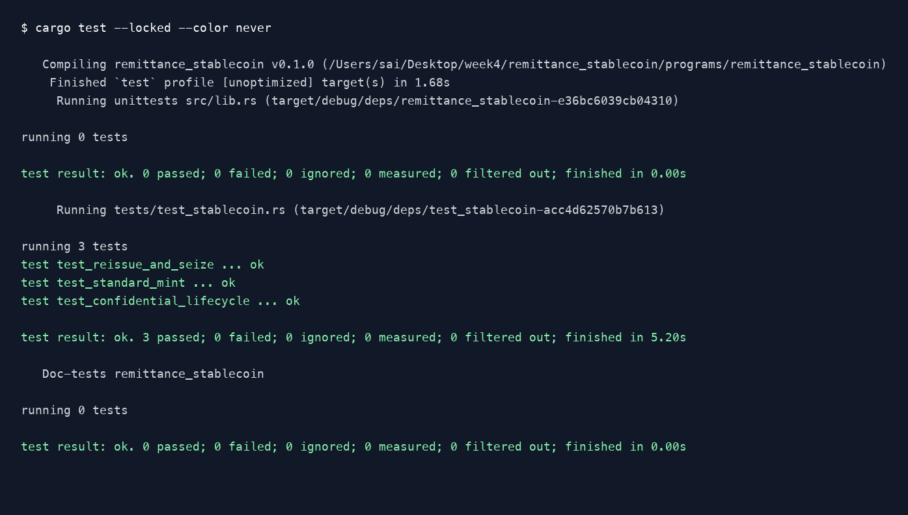

# Remittance Stablecoin

An Anchor program for a remittance stablecoin using Token-2022 extensions, with Rust integration tests in LiteSVM.

## Original mint

- `TransferFeeConfig`: 1% transfer fee, capped at one token.
- `MetadataPointer`: points to the mint, which also stores `TokenMetadata`.
- `DefaultAccountState`: new token accounts start frozen until KYC clearance.
- `MintCloseAuthority`: allows the issuer to close the mint when its supply is zero.

Mint storage is calculated with `ExtensionType::try_calculate_account_len`. Fixed extensions initialize be[package]
name = "t22"
version = "0.1.0"
description = "Created with Anchor"
edition.workspace = true
rust-version.workspace = true

[lib]
crate-type = ["cdylib", "lib"]
name = "t22"

[features]
default = []
cpi = ["no-entrypoint"]
no-entrypoint = []
no-log-ix-name = []
idl-build = ["anchor-lang/idl-build",
             "anchor-spl/idl-build", 
                ]
anchor-debug = []
custom-heap = []
custom-panic = []


[dependencies]
anchor-lang = "1.2.0"
anchor-spl = { version = "1.2.0", features = ["token_2022", "token_2022_extensions"] }


[dev-dependencies]
litesvm = "0.16.0"
solana-keypair = "3.1.2"
solana-message = "4"
solana-signer = "3.0.1"
solana-transaction = "4.1.4"
solana-account = "4"
solana-system-interface = "3.2"
solana-compute-budget-interface = "3"
zk = { package = "solana-zk-sdk", version = "7" }
t22new = { package = "spl-token-2022-interface", version = "3.1" }
proofgen = { package = "spl-token-confidential-transfer-proof-generation", version = "0.6" }
proofext = { package = "spl-token-confidential-transfer-proof-extraction", version = "0.6" }
zkif = { package = "solana-zk-elgamal-proof-interface", version = "0.1" }
bytemuck = "1"

[lints.rust]
unexpected_cfgs = { level = "warn", check-cfg = ['cfg(target_os, values("solana"))'] }fore `InitializeMint2`; actual token metadata initializes afterward.

## Reissued mint

A new mint carries the same extensions, plus:

- `PermanentDelegate` for seizure of public balances.
- `ConfidentialTransferMint` with manual account approval.
- `ConfidentialTransferFeeConfig` for encrypted transfer fees.

Reissuance does not automatically migrate balances from the original mint.

## Instructions

- `initialize`: create the original mint.
- `reissue_mint`: create the confidential mint.
- `transfer_with_fee`: use `transfer_checked_with_fee` and calculate the fee for the current epoch.
- `thaw_after_kyc`: thaw an individual token account without changing the mint's default.
- `approve_confidential_account`: approve a configured account for confidential operations.
- `deposit_confidential_tokens`: move public funds into confidential pending balance.
- `apply_pending_balance`: make pending funds available for spending.
- `seize_public_tokens`: transfer public funds using the permanent delegate.
- `close_mint`: close a zero-supply mint.

Mint and token-account reads use `StateWithExtensions`. The Rust test helpers handle owner-only configuration, confidential transfer proofs, and withdrawal. Withdrawal applies pending balance before generating its proofs. Creating an ATA for someone does not authorize configuring their confidential keys.

## Seizure and confidentiality

The permanent delegate cannot seize confidential balances. Manual approval and freezing provide controls, but do not grant confidential spending authority. The lifecycle test demonstrates this limitation. Deposits and withdrawals expose their amounts; confidential transfers hide amounts while account addresses remain public.

## Run

Requires Rust 1.94.0 and the Solana build tools. Dependencies use Anchor 1.2.0 and LiteSVM 0.16.0.

```sh
cargo build-sbf --manifest-path programs/remittance_stablecoin/Cargo.toml
cargo test --locked --test test_stablecoin
```

## Tests

- `test_standard_mint`: extensions, metadata, sizing, KYC thaw, epoch-aware fees, and mint closure.
- `test_reissue_and_seize`: reissued mint configuration and public seizure.
- `test_confidential_lifecycle`: owner configuration, manual approval, deposit, apply, confidential transfer with fees, and withdrawal.



Rendered from the actual [test output](proof/test-results.txt), not a desktop screenshot.

## Structure

```text
remittance_stablecoin/
├── Anchor.toml
├── Cargo.toml
├── Cargo.lock
├── rust-toolchain.toml
├── README.md
├── proof/
│   ├── passing-tests.png
│   └── test-results.txt
└── programs/remittance_stablecoin/
    ├── Cargo.toml
    ├── src/lib.rs
    └── tests/
        ├── test_stablecoin.rs
        └── common/
            ├── mod.rs
            └── confidential.rs
```

The payer holds the issuer authorities. KYC is performed off-chain, and fees are withheld on recipient accounts. Tests run locally with temporary keypairs; no cluster deployment or reserve backing is included.
