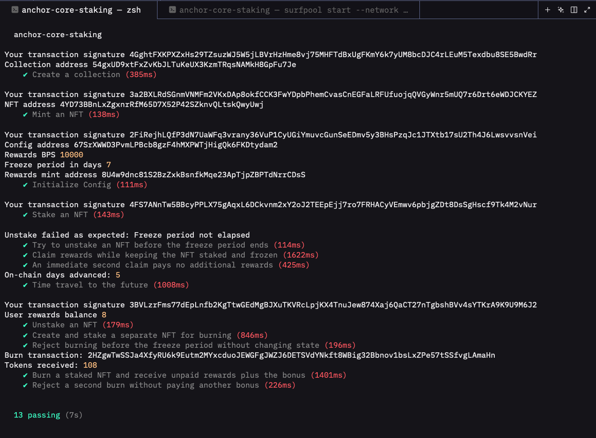

# Anchor Core Staking

A Solana NFT staking program built with Anchor and Metaplex Core. Users can stake Core NFTs, claim accumulated reward tokens while their NFTs remain frozen, or permanently burn a staked NFT to receive unpaid rewards plus a fixed bonus.

The collection tracks the number of currently staked NFTs through its own Attributes plugin.

## Features

### Claim rewards without unstaking

- Mints unpaid rewards into the NFT owner's reward associated token account (ATA), creating the ATA if needed.
- Keeps the NFT owned by the user, marked as staked, and frozen.
- Advances a reward checkpoint so subsequent claims cannot pay the same days again.
- Preserves the original staking timestamp and unpaid partial days.
- Allows claims before the minimum unstaking period ends. A claim with no complete unpaid day succeeds without minting rewards or advancing the checkpoint.

### Burn-to-earn with BurnDelegate

- Requires the owner to sign and the minimum staking period to have elapsed.
- Pays unpaid normal rewards plus a fixed **100-token bonus**.
- Thaws the NFT, adds a BurnDelegate assigned to the program's authority PDA, and burns through that delegate.
- Mints the payment into the owner's reward ATA and decrements the collection staking counter.
- Runs all operations in one transaction: a failure rolls back the burn and reward payment. A burned NFT cannot earn another bonus.

### Collection staking statistics

The collection's Attributes plugin stores `total_staked`, initialized to `"0"` at collection creation.

| Action | Counter change |
| --- | --- |
| Stake | +1 |
| Claim rewards | Unchanged |
| Unstake | -1 |
| Burn a staked NFT | -1 |
| Rejected transaction | Unchanged |

The shared counter helper preserves unrelated collection attributes and rejects missing, duplicate, malformed, overflowing, or underflowing counters.

## Instructions

| Rust instruction | TypeScript method | Purpose |
| --- | --- | --- |
| `create_collection` | `createCollection` | Create a Core collection, assign its authority PDA, and initialize its staking counter |
| `mint_asset` | `mintAsset` | Create a Core NFT in the collection, owned by the signing user |
| `initialize` | `initialize` | Create collection-specific staking configuration and a reward mint |
| `stake` | `stake` | Record staking timestamps, freeze the NFT, and increment the counter |
| `claim_rewards` | `claimRewards` | Pay unpaid rewards without ending the stake |
| `unstake` | `unstake` | Enforce the minimum duration, pay remaining rewards, thaw the NFT, and decrement the counter |
| `burn_staked_nft` | `burnStakedNft` | Burn through BurnDelegate and pay unpaid rewards plus the bonus |

## Accounts and authorities

PDAs are derived under this staking program's ID:

| PDA | Seeds | Role |
| --- | --- | --- |
| Config | `["config", collection]` | Stores reward settings and acts as reward mint authority |
| Update authority | `["update_authority", collection]` | Controls collection updates, delegated freezing, and delegated burning |
| Reward mint | `["rewards_mint", config]` | Identifies the collection's reward token |

The config is owned by the staking program. Core owns the collection and NFT accounts. The selected Token Program owns the reward mint and token accounts. Account ownership is separate from mint or plugin authority.

The NFT's Attributes plugin records:

| Attribute | Meaning |
| --- | --- |
| `staked` | `"true"` during an active stake; `"false"` after unstaking |
| `staked_at` | Original staking Unix timestamp in seconds |
| `last_claimed_at` | Timestamp through which complete-day rewards have been paid |

The NFT owner signs staking, claiming, unstaking, and burning requests. Account constraints validate ownership, collection membership, PDA relationships, and reward destinations.

## Reward calculation

Rewards accrue in **complete days**, with 86,400 seconds per day:

```text
unpaid_days = floor((current_timestamp - last_claimed_at) / 86,400)
reward_base_units = floor(unpaid_days × rewards_bps × 10^decimals / 10,000)
```

Despite its name, `rewards_bps` scales a daily token reward; it is not applied to an NFT price or deposited token balance. For example, `10_000` yields one token per complete day, and `500` yields 0.05 tokens per day. The reward mint is initialized with six decimals, so one token equals 1,000,000 base units.

A claim advances `last_claimed_at` by only the complete days paid. Claiming after 3.5 days pays three days and retains the remaining half-day. The minimum staking duration always uses `staked_at`, so claiming never restarts the lock period. Older stakes without a reward checkpoint use `staked_at` as the initial checkpoint.

Example with `rewards_bps = 10_000` and a seven-day minimum:

```text
Stake → wait 3 days → claim 3 tokens
      → wait 5 more days → unstake and receive 5 tokens
Total: 8 tokens, with no duplicate payment
```

For a separate NFT staked for eight days without claims:

```text
Burn payment = 8 unpaid tokens + 100 bonus tokens = 108 tokens
```

Earlier claims reduce unpaid normal rewards, but do not reduce the fixed burn bonus.

## Local setup and tests

Prerequisites: Rust and Solana/Agave tooling, Anchor CLI **0.31.1**, Node.js, Yarn, and Surfpool. The program uses `anchor-lang` and `anchor-spl` 0.31.1, with the `mpl-core` 0.11 dependency series.

The configured wallet is `~/.config/solana/id.json`. The local program ID is:

```text
CWbeg69j7yMXJ697RLMmXu11T7fRLEbtdxwHX2f1yfQS
```

Install JavaScript dependencies and build from the project root:

```bash
yarn install
NO_DNA=1 anchor build
```

Start Surfpool in one terminal:

```bash
NO_DNA=1 surfpool start --network devnet --no-deploy --no-tui
```

Keep it running, then execute the tests in another terminal:

```bash
NO_DNA=1 anchor test --skip-local-validator
```

Surfpool runs locally, using devnet as its remote source for dependencies such as Metaplex Core. Anchor deploys the staking program to the local network. The tests use Surfpool's `surfnet_timeTravel` RPC; an ordinary local validator does not provide this method.

Time travel reads the on-chain Clock rather than the computer's wall clock. The Clock uses seconds, while Surfpool's `absoluteTimestamp` uses milliseconds. This also avoids incorrect time targets when Surfpool stays running between test runs.

## Test proof

The supplied screenshot shows **13 passing integration tests**. The suite covers collection creation, NFT minting, configuration, staking, early unstake rejection, claims while frozen, repeated claims, unpaid rewards at unstake, burn eligibility, burn payment, and repeated burn rejection. Counter assertions check collection statistics throughout the lifecycle.



## Project structure

```text
programs/anchor-core-staking/src/
├── lib.rs                         # Public instruction entry points
├── error.rs                       # Program errors
├── state/config.rs                # Collection staking settings
└── instructions/
    ├── create_collection.rs        # Core collection and initial counter
    ├── mint_asset.rs               # Core NFT creation
    ├── initialize.rs               # Config and reward mint setup
    ├── stake.rs                    # Staking attributes and freezing
    ├── claim_rewards.rs            # Reward claims and checkpoints
    ├── unstake.rs                  # Remaining rewards and thawing
    ├── burn_staked_nft.rs          # Delegated burn and fixed bonus
    └── update_total_staked.rs      # Shared collection counter helper
tests/anchor-core-staking.ts        # Surfpool integration tests
proof.png                          # Passing-test screenshot
```

## Current implementation boundaries

- `admin` in initialization is a signing payer; the code does not restrict initialization to a designated administrator wallet.
- NFT minting is open through the program. The fixed bonus and minimum duration are learning-project rules, not a complete reward-economy design.
- Staking currently adds a FreezeDelegate each time. Restaking an NFT with an existing FreezeDelegate needs an update path and is not covered by the current suite.
- Burning currently adds BurnDelegate and expects that plugin to be absent. An existing BurnDelegate causes failure rather than being replaced.
- Collection counter updates require the initialized Attributes plugin; existing collections need explicit migration rather than assuming a zero counter.

## Troubleshooting

- **`DeclaredProgramIdMismatch`:** Compare `anchor keys list` with `declare_id!` and `Anchor.toml`, align the IDs, then rebuild.
- **`Unsupported program id` during a Core CPI:** Check that the local network can load Metaplex Core and that Surfpool's remote source is reachable.
- **`surfnet_timeTravel: Method not found`:** Run against Surfpool with `--skip-local-validator`.
- **Unexpected freeze-period failures:** Advance from the current on-chain Clock, not `Date.now()`.
- **SBF stack-frame diagnostic:** An observed `mpl_core` dependency diagnostic reported a frame larger than 4,096 bytes. Passing integration tests do not establish that this build diagnostic is resolved; investigate it if it appears in your build output.
